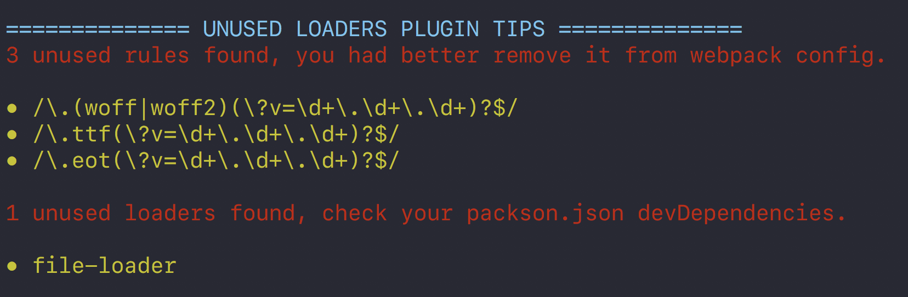
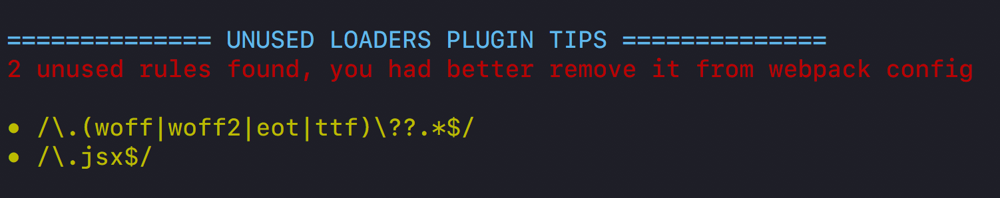
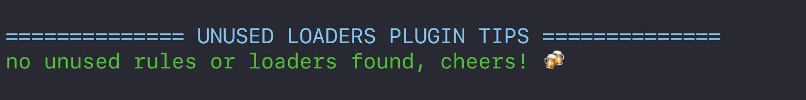

# UnusedLoadersPlugin

A webpack plugin to find unused rules/loaders







## Install

```bash
npm i unused-loaders-plugin --save-dev 

# or use yarn :)
yarn add unused-loaders-plugin -dev
```

## Usage

```js
// webpack configuration
const UnusedLoadersPlugin = require('unused-loaders-plugin')

module.exports = {
  // other config
  plugins: [
    new UnusedLoadersPlugin()
    // other plugins
  ]
}
```


